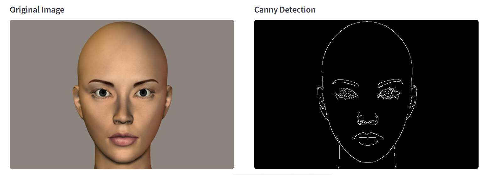
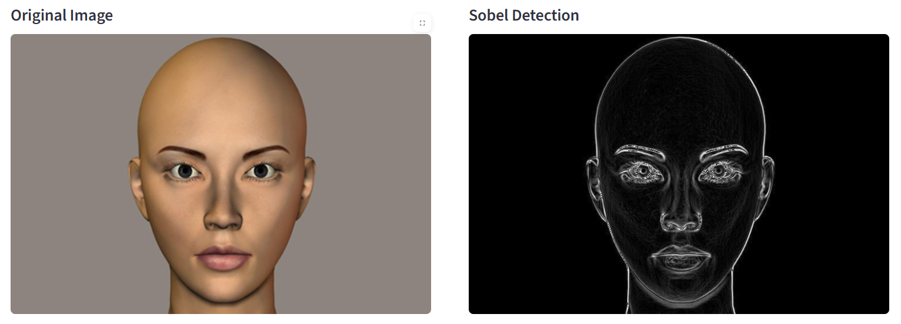
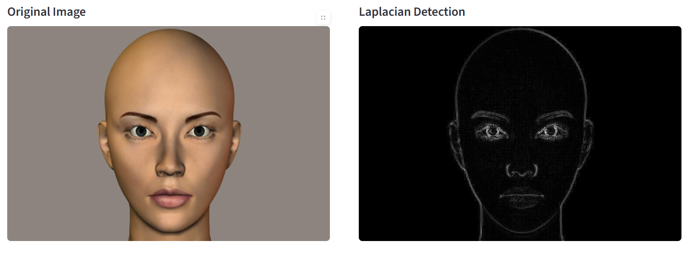

## 🚀 Features

- Upload your own image or use sample images  
- Choose from **Canny**, **Sobel**, or **Laplacian** algorithms  
- Adjust parameters like thresholds, kernel size, and sigma  
- Real-time visualization of results  
- Clean, interactive UI built with Streamlit and custom CSS  

---

## ⚙️ How to Run

1. Clone this repository using git commit
2. Install dependencies:
   bash
   pip install -r requirements.txt

3. Run the app:
   streamlit run app.py

4. Open your browser at `http://localhost:8501`.

### Outputs

###  Canny Edge Detection

###  Sobel Edge Detection

###  Laplacian Edge Detection

